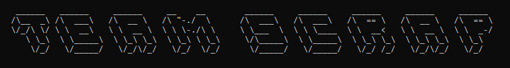

# Team Scrap

<p> Programa criado para facilitar o uso dos assignments no Microsoft Teams </p>



## Começando

Essas instruções farão com que você consiga rodar o projeto na sua máquina local

### Pré-requisitos

É necessário que você possua Python3 instalado em sua máquina<br>
:snake: Download do Python3 [aqui](https://www.python.org/downloads/)

Dentro da pasta do projeto, no cmd ou terminal, digite esse comando para instalar as dependências: 

~~~python
python -m pip install -r requirements.txt
~~~

### Executando

Após finalizar a instalação das dependências, execute o script principal:

#### Windows
```
src\main.py
```

#### Linux e Mac
```
python3 src/main.py
```

### Como utilizar

Quando o script for iniciado pela primeira vez, será necessário informar o seu Token que dá acesso à API do `onenote.com`

Para conseguir pegar esse Token, digite `?` quando o programa pedir para informar esse código, para receber um mini tutorial de como pegá-lo

Caso prefira, aqui vai um tutorial com imagens:

- Logue na sua conta do Microsoft Teams e vá para a página de equipes<br>
[Passo 1](images/tutorial1.png)

- Após isso, aperte **F12** e vá para a aba **Network** na devtools<br>
[Passo 2](images/tutorial2.png)

- Depois, vá para a aba **Tarefas** e espere aparecer um item chamado **classes** na devtools<br>
[Passo 3](images/tutorial3.png)

- Clique nesse item, vá para a aba **Headers** e desça até encontrar o **Request Headers**, após isso visualize o header **authorization** e copie todas as letras e números após a palavra **Bearer**<br>
(Lembre-se que é apenas para copiar o código do header authorization)<br>
[Passo 4](images/tutorial4.png)

Após seguir esses passos, você possui o seu Token!<br>
Para começar utilizar o programa, apenas cole esse código quando for pedido

OBS.: Esse Token pode expirar depois de algum tempo e será necessário refazer esses passos, enquanto o Token for válido ele ficará salvo na sua máquina encriptado para uso

### Construído com

- [Requests](https://requests.readthedocs.io/) - Feito para fazer as requisições nos endpoints necessários
- [Coloroma](https://pypi.org/project/colorama/) - Cores e perfurmação no terminal
- [datetime](https://docs.python.org/3/library/datetime.html) - Utilizado para formatar a data e calcular dias
- [cryptography](https://cryptography.io/) - Utilizado para encriptar e decriptar o Token

### Autores

- Projeto criado por [Luis Brandino](https://github.com/luisbrandino)